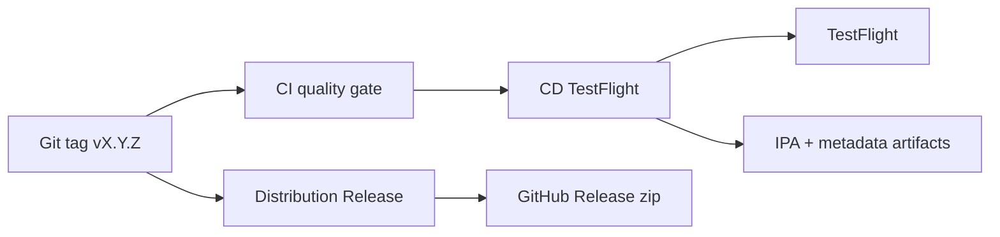

# Ethereal Veil — Distribution Automation

## Version

- **Marketing:** 1.1.0
- **Bundle ID:** `com.worldclassscholars.etherealveil`
- **Team:** `TM2WG7HH96`

## Fully automated pipeline



### On every semver tag

1. **distribution-release.yml** — regenerates promo images + investor PDF, publishes GitHub Release with zip bundle.
2. **cd.yml** — runs tests, archives signed IPA, validates, uploads to TestFlight, uploads distribution artifacts.

### Manual triggers

```bash
# Validate secrets only
gh workflow run "Distribution — Validate Setup"

# TestFlight without upload (archive + export only)
gh workflow run "CD — TestFlight (Production)" -f skip_upload=true

# TestFlight with custom version
gh workflow run "CD — TestFlight (Production)" -f marketing_version=1.1.0
```

## One-time secret setup

See [GITHUB_SECRETS_SETUP.md](GITHUB_SECRETS_SETUP.md) and run:

```bash
./scripts/export_signing_secrets.sh   # print values
./scripts/push_github_secrets.sh      # upload via gh CLI
```

## Regenerate assets locally

```bash
pip install -r scripts/requirements.txt
python3 scripts/generate_distribution_assets.py
python3 scripts/ethereal_veil_investor_report.py
./scripts/bundle_distribution.sh dist
```

## Outputs

| Artifact | Location |
|----------|----------|
| IPA | GitHub Actions → EtherealVeil-ipa-* |
| Distribution zip | `dist/EtherealVeil-Distribution-v*.zip` |
| Investor PDF | `distribution/EtherealVeil_Investor_Report.pdf` |
| Promotional images | `Promotional/` |
| App Store metadata | `distribution/app-store/metadata/en-US/` |
| Screenshots | `distribution/app-store/screenshots/en-US/` |

## StoreKit (local IAP testing)

Open `EtherealVeil/Products.storekit` in Xcode → Scheme → Run → Options → StoreKit Configuration.

## Fastlane (optional)

```bash
bundle install
export ASC_KEY_PATH=path/to/AuthKey.p8
export ASC_KEY_ID=...
export ASC_ISSUER_ID=...
bundle exec fastlane beta      # TestFlight upload
bundle exec fastlane metadata # screenshots + metadata only
```
